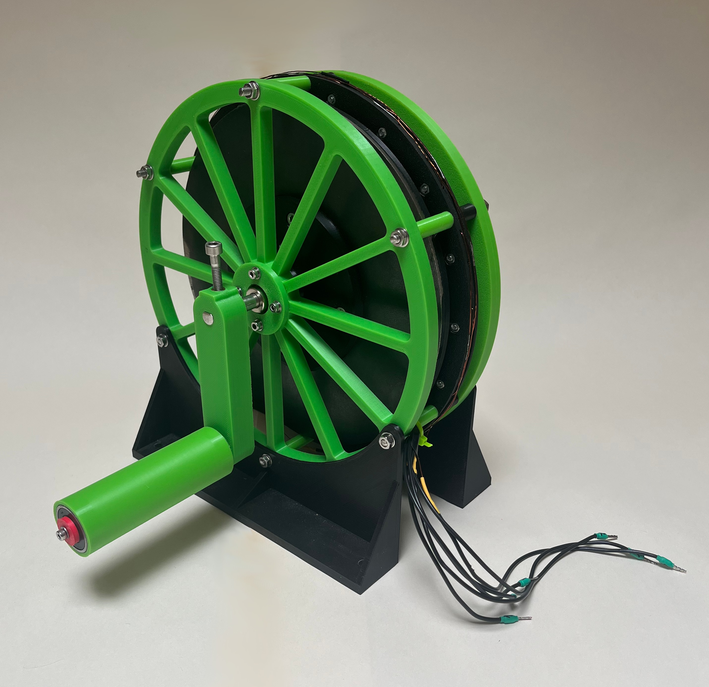
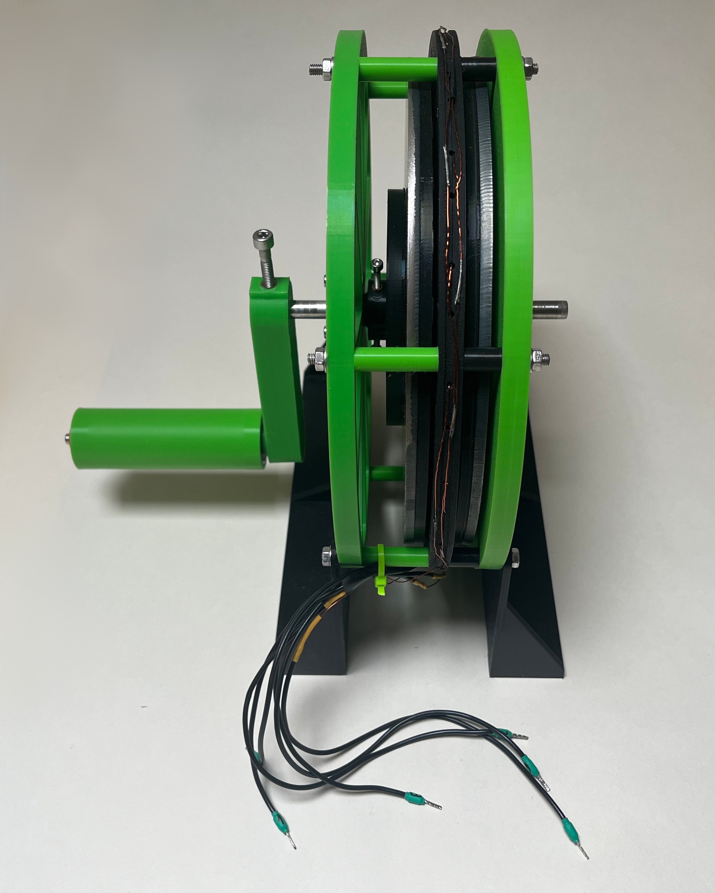
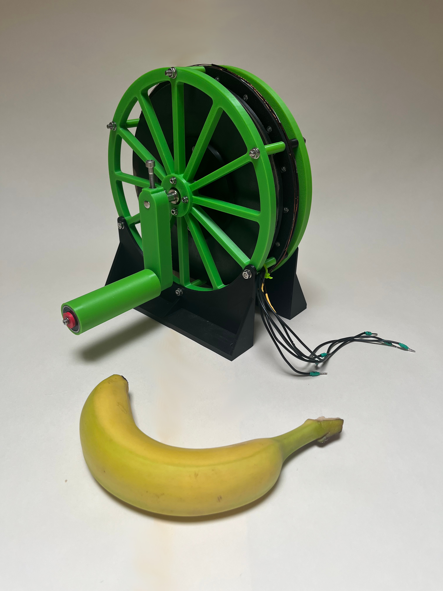
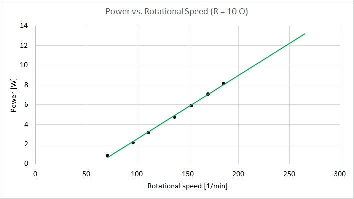

# 3D Printed Gearless Generator

A personal engineering project focused on developing a **low-speed, gearless, modular three-phase generator** built using 3D printed parts and off-the-shelf components. The generator is designed as a scalable platform, allowing multiple generating stages to be combined into a larger system while maintaining the same core architecture.

The goal of this project is to explore practical small-scale energy generation systems that are:
- quiet in operation (no gearbox)
- reproducible with consumer-grade tools (FDM 3D printing)
- modular and scalable
- adaptable for different use cases (manual, wind, hydro, test rigs)

---

## 🔧 Project Overview

This generator is designed as a modular experimental platform for low-speed energy generation.

It has been developed through multiple iterations, current design uses:
- 3D printed structural and rotor components
- steel sheet discs
- neodymium magnets
- copper windings
- standard bearings
- basic mechanical fasteners

---

## ⚙️ Intended Applications

This generator is intended for experimental and educational use, including:
- hand-crank power generation for emergency low-power supply (e.g., charging mobile phones and powering LED lighting during grid outages)
- small wind turbine systems
- micro hydro setups
- energy harvesting experiments
- test bench / R&D use cases

---

## 📊 Current Status

The project is in an iterative development phase.

### Achievements so far:

- Successfully demonstrated manual energy generation capable of charging a smartphone via hand crank (~5 W mechanical input power range)
- Measured open-circuit and loaded voltage vs. rotational speed (U(n) characteristic) under different electrical load conditions
- Conducted initial generator performance characterization across multiple operating points

### Known limitations:
- detailed efficiency mapping not yet completed
- environmental protection (weatherproofing for wind turbine or hydro) not implemented

---

## 🧪 Testing & Measurements

Work is ongoing to establish efficiency under different operating regimes

---

## 📁 Repository Contents (planned)

- `/photos` – build and prototype images
- `/stl` – (not included at this stage)

---

## ⚠️ Notes

This is a personal engineering project.  
Designs are still under active development and may change significantly between iterations.

---

## 📌 Author

Independent engineering project focused on mechanical design, prototyping, and energy systems experimentation.

---

## Video demonstration

Short demonstration of the generator.

[YouTube Short](https://www.youtube.com/shorts/bMeE2kEtJIk)
